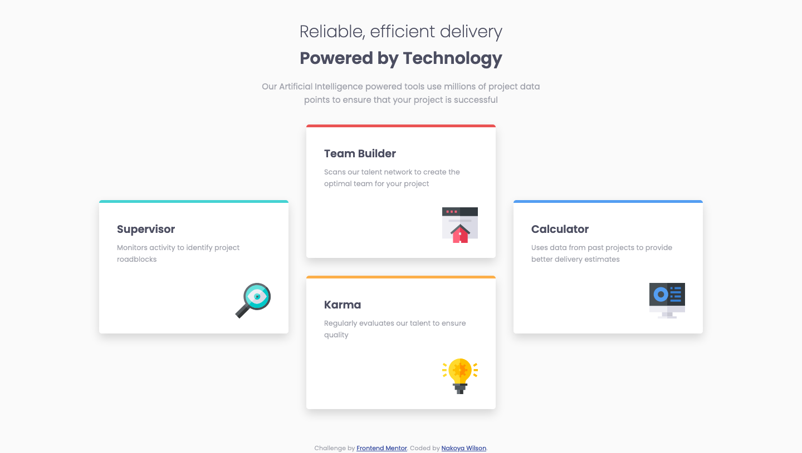

# Frontend Mentor - Four card feature section solution

This is a solution to the [Four card feature section challenge on Frontend Mentor](https://www.frontendmentor.io/challenges/four-card-feature-section-weK1eFYK). Frontend Mentor challenges help you improve your coding skills by building realistic projects. 

## Table of contents

- [Overview](#overview)
  - [The challenge](#the-challenge)
  - [Screenshot](#screenshot)
  - [Links](#links)
- [My process](#my-process)
  - [Built with](#built-with)
- [Author](#author)

## Overview

### The challenge

Users should be able to:

- View the optimal layout for the site depending on their device's screen size

### Screenshot

### Links

- Solution URL: [https://www.frontendmentor.io/solutions/four-card-feature-section-using-flexbox-AfEa2wxif](https://www.frontendmentor.io/solutions/four-card-feature-section-using-flexbox-AfEa2wxif)
- Live Site URL: [https://nakoyawilson.github.io/four-card-feature-section/](https://nakoyawilson.github.io/four-card-feature-section/)

## My process

### Built with

- HTML
- CSS
- Flexbox

## Author

- Website - [Nakoya Wilson](https://nakoyawilson.netlify.app/)
- Frontend Mentor - [@nakoyawilson](https://www.frontendmentor.io/profile/nakoyawilson)
- Twitter - [@nakoyawilson](https://twitter.com/nakoyawilson)
- LinkedIn - [@nakoyawilson](https://www.linkedin.com/in/nakoyawilson/)

